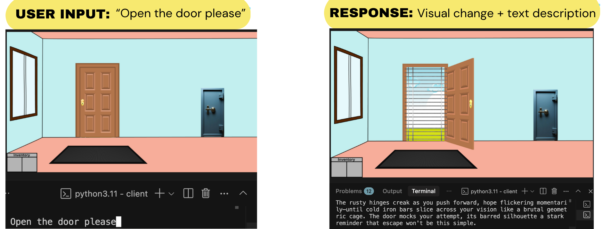

# MCP Game: Behind Bars

Welcome! The **Model Context Protocol (MCP)** is rapidly transforming how companies operate, from empowering internal teams with swift data access to enabling users to interact with software through intuitive, natural-language interfaces.

This project, however, applies MCPs in a unique way: **The MCP Game**. It's an interactive text-based adventure where you are trapped in an escape room. Players must navigate the room, solve puzzles, and collect items by interacting with an AI to find their way to freedom. This game, beyond being enjoyable to build and play, offers significant insights into the world of MCPs and their increasingly vital role.



## 🏗️ Architecture

As mentioned, this game leverages the power of the MCP. Here's a breakdown of its architecture:

This project consists of two main components: the client and the server.

-   **Client** (`client/`): A Python application that manages user interaction and communicates with the game server. It's responsible for taking user input, orchestrating calls to Large Language Models (LLMs), and invoking MCP tools (which map to the various actions you can take within the room) provided by the server.
-   **Server** (`server/`): A FastAPI-based server that maintains the game state, handles room logic, and defines all available player actions. This server was transformed into an MCP server in just three lines of code using the open-source [FastAPI-MCP project](https://github.com/tadata-org/fastapi_mcp).

## 🚀 Quick Start

### Installation

1.  **Clone the repository:**
    ```bash
    git clone [https://github.com/tadata-org/MCP-Game](https://github.com/tadata-org/MCP-Game)
    cd mcp-game
    ```

2.  **Install dependencies:**
    ```bash
    # Install client dependencies
    cd client
    pip install -e .

    # Install server dependencies
    cd ../server
    pip install -e .
    ```

3.  **Set up your environment variables:**
    ```bash
    # Create a .env file in the client directory to provide your LLM API key
    echo "ANTHROPIC_API_KEY=your_api_key_here" > client/.env
    ```

### Running the Game

1.  **Run the server:**
    ```bash
    cd server
    uvicorn behind_bars_fastapi_server:app --reload --port 8000
    ```

2.  **Start the game client:**
    ```bash
    cd client
    python game_client.py
    ```

3.  Follow the on-screen instructions to play the game and escape!

## 🎯 Game Features

-   **Interactive Text Adventure**: Navigate the room and perform actions using natural language commands.
-   **AI-Powered Responses**: Experience dynamic and engaging narrative responses based on your actions and the current game state.
-   **Inventory System**: Collect and strategically use items to solve intricate puzzles.
-   **Visual Elements**: Immerse yourself with descriptive images and rich room descriptions that evolve with your progress.

## 🛠️ Technical Details

### Client (`client/`)

-   Built with Python.
-   Manages user input/output and orchestrates the game flow.
-   Communicates with the server via the MCP protocol.
-   Integrates with Anthropic's API for AI responses: one LLM call parses the user's intended action, and a second narrates the result back to the user.
-   Utilizes Streamable HTTP for efficient client-server communication.

### Server (`server/`)

-   FastAPI-based server implementation.
-   Transformed into an MCP server using FastAPI-MCP.
-   Manages core game logic and room states.
-   Handles asset management (for dynamic image generation).
-   Each available action in the game is exposed as a dedicated FastAPI endpoint.
-   Uses Streamable HTTP to communicate with the client.

### Adding New Features

This project serves primarily as a proof-of-concept, demonstrating the utility of the MCP in game applications where LLM power is desired. The client-server architecture inherent to the MCP lends itself exceptionally well to such scenarios, where MCP "tools" directly represent the actions available for the LLM (and, by extension, the user) to interact with the game world.

We encourage you to expand upon our single escape room. Consider adding:

1.  **New Rooms**: Implement additional room logic and corresponding visual assets.
2.  **New Items and Puzzles**: Introduce more complex puzzles and items, offering multiple paths for user interaction.
3.  **AI Enhancements**: Experiment with and modify the client's AI interaction logic. The game's quality is significantly influenced by the LLM prompts that power it. We spent considerable time refining these prompts and encourage you to do the same!

## 🤝 Contributing

We welcome contributions!

1.  Fork the repository.
2.  Create a feature branch (`git checkout -b feature/amazing-feature`).
3.  Commit your changes (`git commit -m 'Add some amazing feature'`).
4.  Push to the branch (`git push origin feature/amazing-feature`).
5.  Open a Pull Request.

## 📝 License

This project is licensed under the MIT License.

## 📞 Support

If you encounter any issues or have questions, please open an issue on GitHub.

---

**Enjoy escaping from Behind Bars!** 🚪🔑
